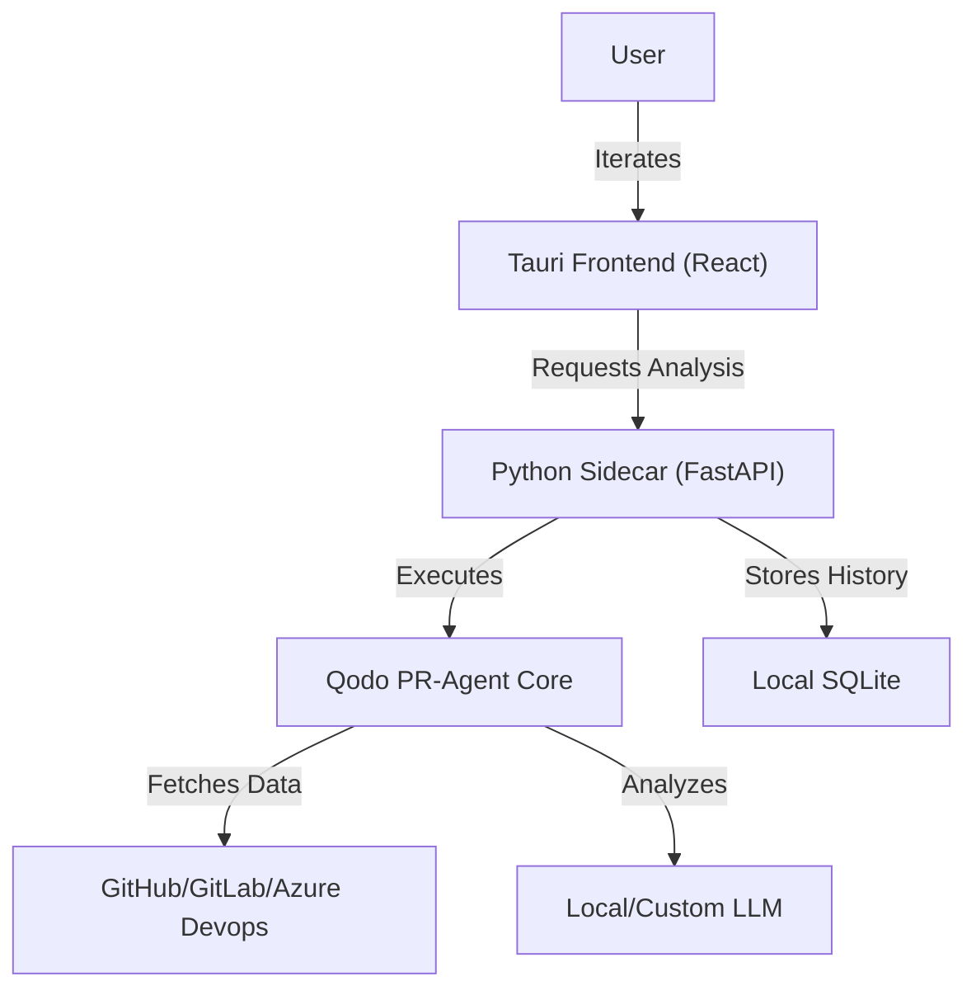

# PR Review Agent (Local UI for Qodo)

A private, local-first desktop application that provides a modern user interface for the **Qodo (formerly Codium)** open-source PR review agent.

Unlike standard Qodo implementations that run in the cloud or via CLI and post comments directly to your PRs, this application is designed for **developers who want full control and privacy**.

## 🌟 Key Features

- **Local-First**: Runs entirely on your own device. Your code and PR data stay local; no cloud processing is involved.
- **UI-Driven Analysis**: View PR reviews, suggestions, and code analysis in a beautiful desktop interface rather than through PR comments.
- **Private Review Cycle**: Review AI suggestions privately in the app before deciding which changes to implement, keeping your PR comments clean.
- **Powered by Qodo**: Leverages the powerful open-source `pr-agent` logic developed by Codium.

## 🏗️ Architecture

The app uses a hybrid architecture to bridge the gap between AI logic and a native desktop experience:



## 🛠️ Prerequisites

- **Node.js** (v18+) and **npm**
- **Python** (3.12+)
- **Poetry** (Python dependency management)
- **Rust** (Required for building Tauri)

## 📦 Installation & Setup

### 1. Backend Setup

1. Navigate to the `backend` directory.
2. Install dependencies:
   ```bash
   poetry install
   ```
3. Open the application (see **Ways to Run**).
4. Navigate to the **Settings** page within the UI to configure your personal access tokens and AI providers.

### 2. Frontend Setup

1. Navigate to the `frontend` directory.
2. Install dependencies:
   ```bash
   npm install
   ```

## 🚀 Ways to Run

Depending on your needs, you can run the PR Review Agent in several ways:

### 1. Unified Development Mode (Recommended)

This runs the React frontend with hot-reloading and automatically manages the Python sidecar life-cycle.

- **Command**: `npm run tauri` (inside `frontend/`)
- **Best for**: Standard daily usage and development.

### 2. Development Mode (No Sidecar)

Run the Tauri app while managing the backend yourself — useful for backend hot-reloading with `--reload`.

1. Start the backend manually:
   ```bash
   cd backend
   poetry run uvicorn app.main:app --reload --port 47685
   ```
2. In a separate terminal, launch the Tauri app:
   ```bash
   cd frontend
   npm run tauri:nosidecar
   ```

The app will detect the missing sidecar and log a warning, then connect to your manually-started backend on port `47685`.

### 3. Standalone Production App

Once built, the application runs as a native Windows executable.

- **Location**: `frontend/src-tauri/target/release/PR-Review-Agent.exe`
- **Sidecar**: The Python backend is bundled inside and starts automatically.
- **Best for**: Regular usage without needing a terminal.

### 4. Debugging Backend Only

You can run the FastAPI server standalone to test API endpoints or Qodo integration logic directly.

- **Command**: `python desktop_launcher.py` (inside `backend/`)
- **Access**: `http://127.0.0.1:47685/docs`
- **Best for**: Troubleshooting AI analysis logic or API issues.

## 💡 Usage Workflow

This application provides a "Private Review" workflow that differs from standard Qodo integrations:

1.  **Configuration**: Set your Git provider tokens (GitHub, GitLab, etc.) and AI API keys in the app settings. No manual `.env` configuration is required.
    - **Recommended Setup**: We suggest using **Ollama** for local models or **Gemini 2.0 Flash Thinking / Gemini 3 Preview (Cloud)** for high-end analysis.
2.  **Trigger Analysis**: Provide a PR URL. The application fetches the data and runs the Qodo `pr-agent` locally.
3.  **Private Review**: Instead of cluttering the PR with AI comments immediately, you review the **suggestions, security analysis, and logic checks** directly in the app.
4.  **Implement & Commit**: Use the insights to improve your code locally, then push your refined changes. This keeps your actual PR conversation focused on human-to-human feedback.

## 📁 Project Structure

- `frontend/`: React components, styles, and Tauri Rust core.
- `backend/`: FastAPI application and Qodo `pr-agent` integration.
- `backend/app/`: Core backend application logic and API endpoints.

## 📄 Recognition

This project is a custom implementation based on the excellent open-source work by the **Qodo (Codium)** team. It is intended to provide an alternative, local-first workflow for their PR Review Agent.
