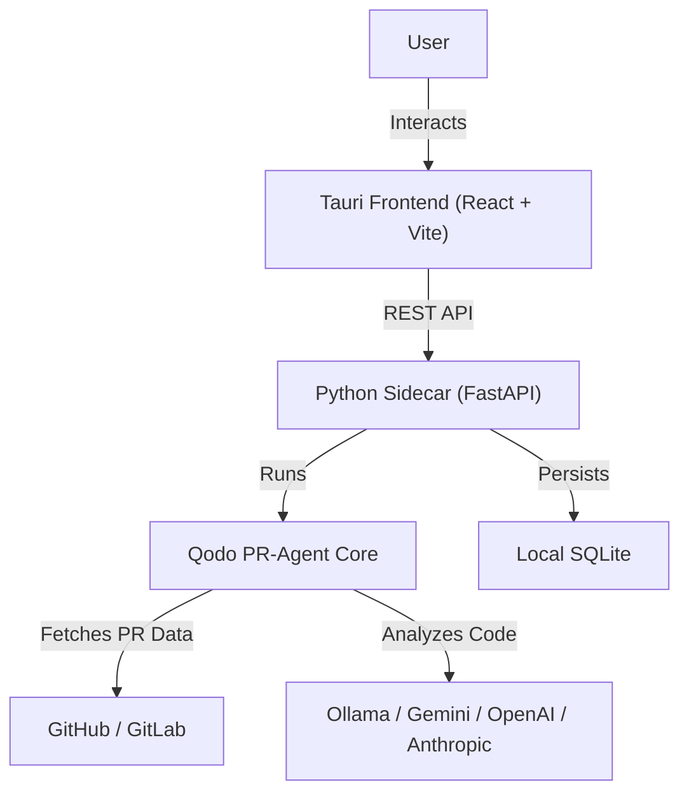

<p align="center">
  
</p>

<h1 align="center">PR Review Agent</h1>

<p align="center">
  <strong>A private, local-first desktop application for AI-powered pull request reviews.</strong>
</p>

<p align="center">
  <a href="https://github.com/moohamedsalman93/pr-review-app/releases/latest"></a>
  <a href="https://github.com/moohamedsalman93/pr-review-app/blob/main/LICENSE"></a>
  
  
</p>

<p align="center">
  Unlike standard Qodo integrations that post AI comments directly to your PRs, this application lets you <strong>review suggestions privately</strong> in a beautiful desktop interface — keeping your PR conversation clean and focused on human feedback.
</p>

---

## ✨ Features

### Core

- **🔒 Local-First & Private** — Runs entirely on your device. Code and PR data never leave your machine.
- **🤖 AI-Powered Analysis** — Leverages the open-source [Qodo PR-Agent](https://github.com/Codium-ai/pr-agent) for deep code review, bug detection, and security analysis.
- **🌐 Multi-Provider** — Works with **GitHub** and **GitLab** pull/merge requests out of the box.
- **🧠 Flexible AI Backend** — Use **Ollama** (local), **Gemini**, **OpenAI**, **Anthropic**, or any LiteLLM-compatible provider.

### Review Experience

- **📝 PR Description Viewer** — Rich rendering of the AI-generated PR description and metadata.
- **💡 Suggestion Cards** — Each suggestion includes severity, category, file path, line numbers, explanation, and a confidence score.
- **🔀 Inline Diff View** — Side-by-side code diffs showing original vs. improved code for every suggestion.
- **📊 Review Scoring** — Overall PR score, effort estimation, and security concern highlights.
- **➕ Extend Reviews** — Generate additional suggestions on any review to dig deeper.
- **💬 Chat with PR** — Ask follow-up questions about the PR directly in the app using AI.
- **📋 Custom Rule Sets** — Define reusable review instruction templates to tailor analysis focus per project or team.

### Desktop App

- **🖥️ Native Window** — Custom frameless window with minimize / maximize / close controls and draggable title bar.
- **🌗 Dark & Light Theme** — Toggle between themes; preference is persisted across sessions.
- **📤 Export to HTML** — Export any review (description + suggestions + diffs) as a self-contained, themed HTML file for sharing.
- **📜 Review History** — Browse, search, and filter all past reviews with pagination.
- **🔔 Desktop Notifications** — Get notified when a background review completes.
- **🔄 OTA Updates** — Automatic update checks with in-app download and install via Tauri's updater plugin.

---

## 🏗️ Architecture



| Layer             | Technology                     | Purpose                                                 |
| ----------------- | ------------------------------ | ------------------------------------------------------- |
| **Desktop Shell** | Tauri v2 + Rust                | Native window, file dialogs, notifications, OTA updates |
| **Frontend**      | React 19, Vite, Tailwind CSS 4 | UI components, routing, theme management                |
| **Backend**       | FastAPI, SQLAlchemy, Uvicorn   | REST API, background task processing                    |
| **AI Engine**     | Qodo PR-Agent, LiteLLM         | Code review, suggestions, PR chat                       |
| **Database**      | SQLite                         | Reviews, suggestions, settings, rule sets               |

---

## 📁 Project Structure

```
pr-review-app/
├── backend/                    # Python backend (FastAPI)
│   ├── app/
│   │   ├── main.py             # FastAPI application entry point
│   │   ├── config.py           # Settings loader (reads from DB)
│   │   ├── database.py         # SQLAlchemy engine & session
│   │   ├── models/             # ORM models (PRReview, Suggestion, AppSettings, RuleSet)
│   │   ├── routers/            # API routes (reviews, settings, rule-sets)
│   │   ├── schemas/            # Pydantic request/response schemas
│   │   └── services/           # Business logic
│   │       ├── pr_agent_service.py   # Qodo PR-Agent integration
│   │       ├── github_service.py     # GitHub API client
│   │       ├── gitlab_service.py     # GitLab API client
│   │       ├── llm_service.py        # LLM abstraction layer
│   │       └── provider_factory.py   # Git provider factory
│   ├── build_sidecar.py        # PyInstaller build script
│   ├── desktop_launcher.py     # Standalone backend launcher
│   └── pyproject.toml          # Poetry dependencies
│
├── frontend/                   # React + Tauri frontend
│   ├── src/
│   │   ├── App.jsx             # Route definitions
│   │   ├── components/
│   │   │   ├── Layout.jsx      # Shell: sidebar, header, theme, window controls
│   │   │   ├── PRForm.jsx      # New review form (PR URL + rule set)
│   │   │   ├── PRHistory.jsx   # Review history list with filters
│   │   │   ├── PRDetail.jsx    # Full review detail page
│   │   │   ├── SuggestionCard.jsx    # Individual suggestion renderer
│   │   │   ├── DiffView.jsx          # Inline code diff viewer
│   │   │   ├── PRDescriptionViewer.jsx  # PR description panel
│   │   │   ├── ChatDrawer.jsx        # AI chat side panel
│   │   │   ├── Settings.jsx          # Provider & AI configuration
│   │   │   └── RuleSets.jsx          # Custom rule set manager
│   │   ├── services/api.js     # Axios HTTP client
│   │   └── utils/exportUtils.js  # HTML export utility
│   ├── src-tauri/              # Tauri (Rust) configuration
│   │   ├── tauri.conf.json     # App config, bundling, updater
│   │   └── capabilities/       # Permission policies
│   ├── scripts/
│   │   └── build-and-release.js  # Automated build & GitHub release
│   └── package.json
│
└── README.md
```

---

## 🛠️ Prerequisites

| Tool        | Version       | Notes                                         |
| ----------- | ------------- | --------------------------------------------- |
| **Node.js** | 18+           | Frontend tooling                              |
| **npm**     | 9+            | Package management                            |
| **Python**  | 3.12+         | Backend runtime                               |
| **Poetry**  | Latest        | Python dependency management                  |
| **Rust**    | Latest stable | Required by Tauri to compile the native shell |

---

## 📦 Installation & Setup

### 1. Clone the Repository

```bash
git clone https://github.com/moohamedsalman93/pr-review-app.git
cd pr-review-app
```

### 2. Backend Setup

```bash
cd backend
poetry install
```

### 3. Frontend Setup

```bash
cd frontend
npm install
```

### 4. Configure the App

Launch the app (see [Ways to Run](#-ways-to-run)), then navigate to **Settings** in the sidebar to configure:

| Setting          | Description                                                       |
| ---------------- | ----------------------------------------------------------------- |
| **GitHub Token** | Personal Access Token with `repo` scope                           |
| **GitLab Token** | Personal Access Token with `read_api` scope                       |
| **GitLab URL**   | Self-hosted GitLab URL (defaults to `https://gitlab.com`)         |
| **AI Provider**  | `ollama`, `openai`, `anthropic`, `gemini`, etc.                   |
| **AI Model**     | Model name (e.g., `gemini-3-flash-preview:latest`, `gpt-4o`)      |
| **AI API Key**   | Provider API key (not needed for Ollama)                          |
| **AI Base URL**  | Custom endpoint (defaults to `http://localhost:11434` for Ollama) |
| **Max Tokens**   | Context window size (default: `128000`)                           |

> [!TIP] > **Recommended Setup**: Use **Ollama** for fully local/private analysis, or **Gemini Flash** for fast cloud-based reviews.

---

## 🚀 Ways to Run

### 1. Unified Development Mode _(Recommended)_

Runs the React frontend with hot-reloading and automatically manages the Python sidecar.

```bash
cd frontend
npm run tauri
```

### 2. Development Mode (No Sidecar)

Run the backend manually for hot-reloading with `--reload`:

**Terminal 1 — Backend:**

```bash
cd backend
poetry run uvicorn app.main:app --reload --port 47685
```

**Terminal 2 — Frontend:**

```bash
cd frontend
npm run tauri:nosidecar
```

The app detects the missing sidecar and connects to your manually-started backend on port `47685`.

### 3. Standalone Production App

After building, the application runs as a native Windows executable with the Python backend bundled inside.

```
frontend/src-tauri/target/release/PR-Review-Agent.exe
```

### 4. Backend Only (API Debugging)

Run the FastAPI server standalone to test API endpoints directly:

```bash
cd backend
python desktop_launcher.py
```

Then visit: `http://127.0.0.1:47685/docs` for the interactive Swagger UI.

---

## 💡 Usage Guide

### Reviewing a Pull Request

1. **Paste a PR URL** on the home page — supports both GitHub and GitLab URLs.
2. _(Optional)_ Select a **Rule Set** to guide the analysis focus.
3. Click **Start Review**. The backend fetches PR data and runs the AI analysis in the background.
4. Once complete, view the results:
   - **PR Description** — AI-generated summary of the changes.
   - **Suggestions** — categorized by severity (info / warning / error) and type (bug, security, performance, style, best practice).
   - **Code Diffs** — original vs. improved code for each suggestion.
   - **Overall Score** and **Effort Estimation**.

### Extending a Review

Click **Extend** on any completed review to generate additional suggestions without re-fetching the PR data.

### Chatting with a PR

Open the **Chat** drawer on a review page and ask natural-language questions about the PR. The AI answers using the PR's context.

### Custom Rule Sets

Navigate to **Rules** in the sidebar to create reusable instruction templates. These are injected as extra instructions during analysis, letting you enforce team conventions, focus areas, or coding standards.

### Exporting a Review

Click the **Export** button on a review detail page to save a self-contained HTML report with:

- PR metadata and description
- All suggestions with diffs
- Dark/light theme toggle
- No external dependencies

---

## 🔨 Building for Production

### Quick Build

```bash
cd frontend
npm run tauri:build
```

This will:

1. Build the React frontend (`vite build`)
2. Build the Python sidecar (`PyInstaller`)
3. Compile the Tauri app (`tauri build`)

Output: `frontend/src-tauri/target/release/bundle/`

### Automated Build & Release

The project includes a release script that builds, signs, and publishes to GitHub Releases:

```bash
cd frontend
npm run release
```

**Required environment variables:**

| Variable                             | Description                                                   |
| ------------------------------------ | ------------------------------------------------------------- |
| `GITHUB_TOKEN`                       | GitHub PAT with `repo` scope (for publishing releases)        |
| `TAURI_SIGNING_PRIVATE_KEY_PATH`     | Path to the minisign private key file (for update signatures) |
| `TAURI_SIGNING_PRIVATE_KEY_PASSWORD` | Password for the private key                                  |

The script supports selective steps via flags: `--backend`, `--tauri`, `--publish`, or `--all`.

---

## 🔄 Over-the-Air Updates

The app uses **Tauri's updater plugin** for automatic updates:

- On launch, the app checks `https://github.com/moohamedsalman93/pr-review-app/releases/latest/download/latest.json` for new versions.
- If an update is available, a chip appears in the header.
- Click it to download and install the update — the app restarts automatically.

---

## 🗄️ API Reference

The backend exposes a RESTful API on `http://localhost:47685`:

### Reviews (`/api/reviews`)

| Method   | Endpoint       | Description                                    |
| -------- | -------------- | ---------------------------------------------- |
| `POST`   | `/`            | Submit a PR URL for review                     |
| `GET`    | `/`            | List reviews (paginated, filterable by status) |
| `GET`    | `/{id}`        | Get review details with all suggestions        |
| `DELETE` | `/{id}`        | Delete a review and all its suggestions        |
| `POST`   | `/{id}/extend` | Generate additional suggestions for a review   |
| `POST`   | `/ask`         | Ask a question about a specific PR             |

### Settings (`/api/settings`)

| Method | Endpoint | Description                      |
| ------ | -------- | -------------------------------- |
| `GET`  | `/`      | Get current application settings |
| `PUT`  | `/`      | Update application settings      |

### Rule Sets (`/api/rule-sets`)

| Method   | Endpoint | Description               |
| -------- | -------- | ------------------------- |
| `GET`    | `/`      | List all active rule sets |
| `POST`   | `/`      | Create a new rule set     |
| `GET`    | `/{id}`  | Get a specific rule set   |
| `PUT`    | `/{id}`  | Update a rule set         |
| `DELETE` | `/{id}`  | Soft-delete a rule set    |

> [!NOTE]
> Visit `http://127.0.0.1:47685/docs` when the backend is running for the full interactive Swagger documentation.

---

## 🧩 Tech Stack

### Backend

- **[FastAPI](https://fastapi.tiangolo.com/)** — Async Python web framework
- **[SQLAlchemy](https://www.sqlalchemy.org/)** — ORM with SQLite
- **[Qodo PR-Agent](https://github.com/Codium-ai/pr-agent)** — AI code review engine
- **[LiteLLM](https://github.com/BerriAI/litellm)** — Unified LLM API proxy
- **[PyGithub](https://github.com/PyGithub/PyGithub)** / **[python-gitlab](https://github.com/python-gitlab/python-gitlab)** — Git provider clients
- **[PyInstaller](https://www.pyinstaller.org/)** — Bundles Python into a standalone executable

### Frontend

- **[React 19](https://react.dev/)** — UI library
- **[Vite](https://vite.dev/)** — Build tool with HMR
- **[Tailwind CSS 4](https://tailwindcss.com/)** — Utility-first CSS
- **[Tauri v2](https://v2.tauri.app/)** — Rust-based desktop framework
- **[Lucide React](https://lucide.dev/)** — Icon library
- **[React Markdown](https://remarkjs.github.io/react-markdown/)** — Markdown rendering
- **[React Syntax Highlighter](https://github.com/react-syntax-highlighter/react-syntax-highlighter)** — Code highlighting
- **[Mermaid](https://mermaid.js.org/)** — Diagram rendering

---

## 📄 Recognition

This project is a custom UI built on top of the excellent open-source [**Qodo PR-Agent**](https://github.com/Codium-ai/pr-agent) by the Codium team. It provides an alternative, privacy-focused workflow for their review engine — running everything locally and presenting results in a native desktop interface instead of PR comments.

---

## 📝 License

This project is open source. See the [LICENSE](LICENSE) file for details.
